# ResolveOps — Product Demo Pitch

> "We replace your entire support department — ticketing, AI, and labor — with one AI-native operation that actually executes refunds, reships, and account changes. Not chatbots. Results."

---

## The Problem (30 seconds)

Your customer support is three separate bills every month:

1. **Helpdesk software** — Zendesk, Intercom ($50-$150/agent/mo)
2. **AI bolt-ons** — Intercom Fin, Zendesk AI ($0.99/resolution and climbing)
3. **Human labor** — in-house or BPO ($8-$25/hr, constant turnover)

You're paying for tools, paying for people to use those tools, and still doing the integration, training, QA, and escalation management yourself.

**Result:** 15-30% of revenue burned on support. Inconsistent quality. Founder time wasted.

ResolveOps collapses all three into one.

---

## The Demo (walk-through)

### 1. Command Center — Everything at a Glance

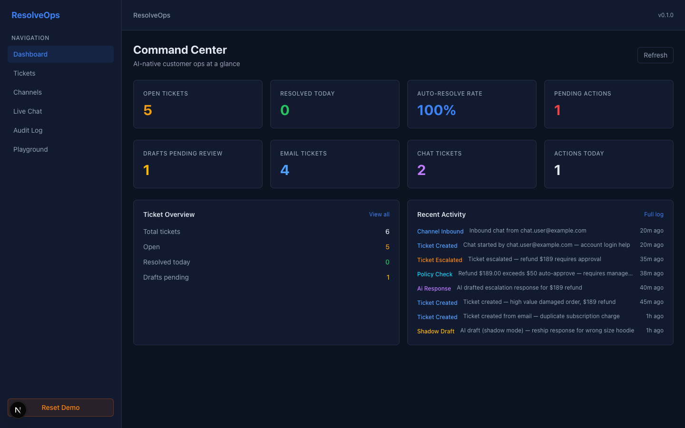

This is what your ops lead sees every morning. One screen, zero tab-switching:

- **5 open tickets** across email and chat channels
- **100% auto-resolve rate** on policy-approved actions
- **1 pending action** awaiting manager approval ($189 refund)
- **1 draft pending review** — AI wrote a response, waiting for human sign-off
- **Channel breakdown** — 4 email, 2 chat (SMS, WhatsApp, voice coming)
- **Live activity feed** — every AI decision, policy check, and action logged in real-time

This isn't a dashboard bolted onto a ticketing system. It's the control plane for your entire support operation.

---

### 2. Ticket Queue — Prioritized, Categorized, Actionable

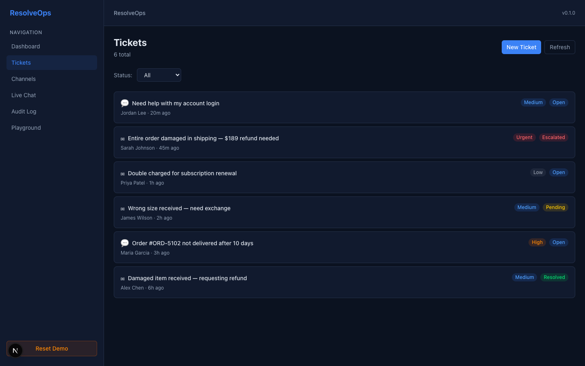

Every ticket shows channel, customer, priority, and status at a glance. No clicking into tickets just to triage them.

- Color-coded status badges: Open, Pending, Escalated, Resolved
- Priority levels: Low to Urgent
- Channel icons distinguish email vs. chat
- Status filter for quick focus (show me only escalated tickets)

---

### 3. The Full Resolution Loop — AI + Policy + Execution

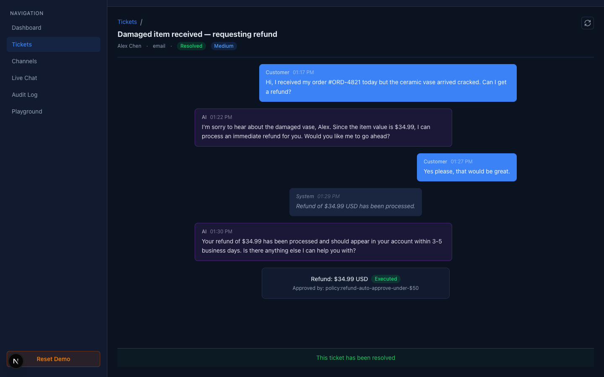

Here's a completed ticket. Watch what happened:

1. **Customer writes in:** "My ceramic vase arrived cracked. Can I get a refund?"
2. **AI responds** in seconds — acknowledges the issue, confirms the $34.99 amount, asks to proceed
3. **Customer says yes**
4. **Policy engine auto-approves** — $34.99 is under the $50 auto-approve threshold
5. **Mock Stripe executor fires** — refund processed, external ID logged
6. **AI confirms** to the customer with timeline (3-5 business days)

Total time: under 2 minutes. Zero human involvement. Full audit trail.

The green "Executed" badge and "Approved by: policy:refund-auto-approve-under-$50" tells you exactly *why* this was allowed to happen automatically.

---

### 4. Shadow Mode — AI Drafts, Humans Approve

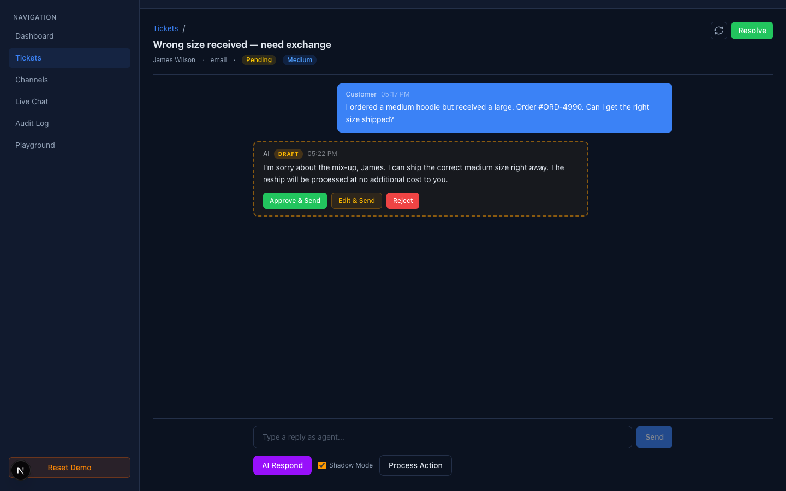

This is the killer feature for trust. **Shadow mode** means the AI writes the response, but it doesn't go to the customer until a human approves it.

See the amber dashed border and "DRAFT" badge? That AI response is invisible to the customer right now. The agent has three options:

- **Approve & Send** — looks good, ship it
- **Edit & Send** — almost right, let me tweak the wording
- **Reject** — wrong approach, I'll write my own

Notice the **Shadow Mode checkbox** at the bottom is checked by default. New customers start in shadow mode. As trust builds, you flip the switch and let AI respond directly.

This is how you go from "I don't trust AI with my customers" to "AI handles 60% of volume" in weeks, not months.

---

### 5. Policy-Gated Actions — High-Risk Needs Approval

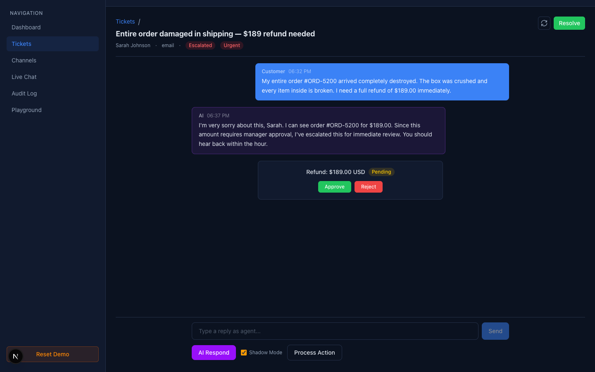

$189 refund? That's above the $50 auto-approve limit. The policy engine catches it:

- AI acknowledges the issue and tells the customer it's been escalated
- The action card shows **"Refund: $189.00 USD — Pending"**
- Manager sees **Approve / Reject** buttons
- One click to execute via mock Stripe, full audit trail logged

The rules are simple and configurable:
- Under $50: auto-approved, auto-executed
- $50-$200: requires manager approval
- Over $200: manual review required

You set the thresholds. The AI respects them. Every action is logged.

---

### 6. Multi-Channel Inbound — Email + Chat, One Queue

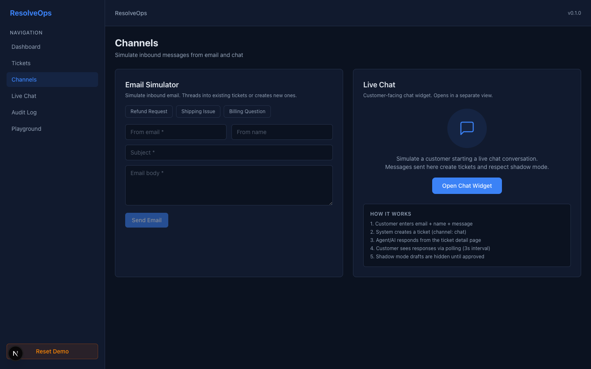

Customers reach you through email and chat (SMS, WhatsApp, voice coming in Phase 2). Every message lands in the same ticket queue. No separate inboxes.

**Email Simulator** — test inbound emails with one-click templates:

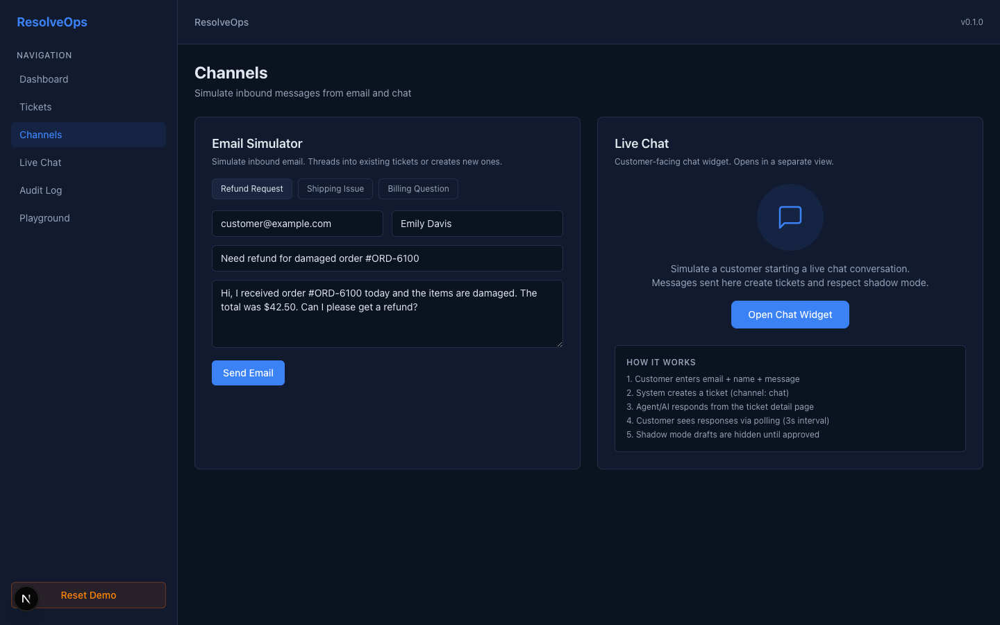

Click "Refund Request" and the form auto-fills with a realistic customer email. Hit send:

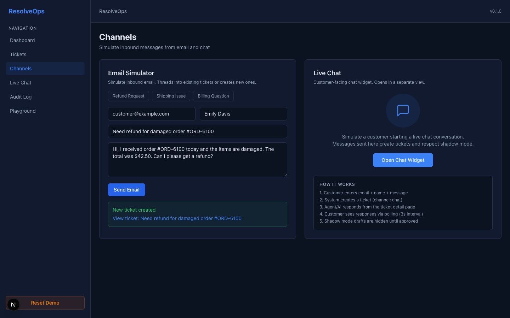

The system either **creates a new ticket** or **threads into an existing one** (matching by customer email + subject line, stripping Re:/Fwd: prefixes). No duplicate tickets for the same conversation.

---

### 7. Live Chat Widget — Customer-Facing

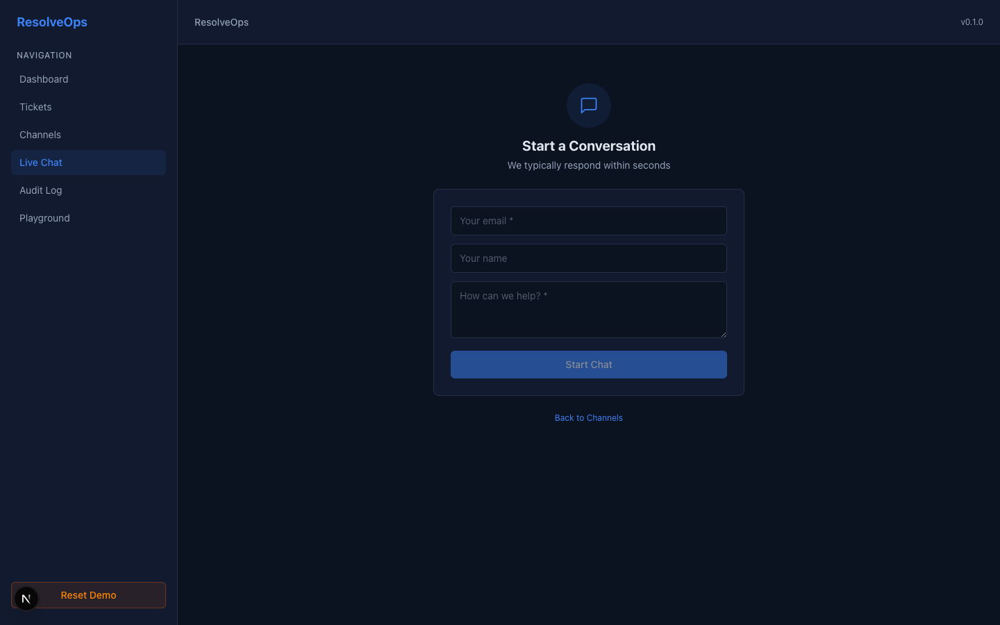

The customer sees a clean chat widget. Email, name, message. That's it.

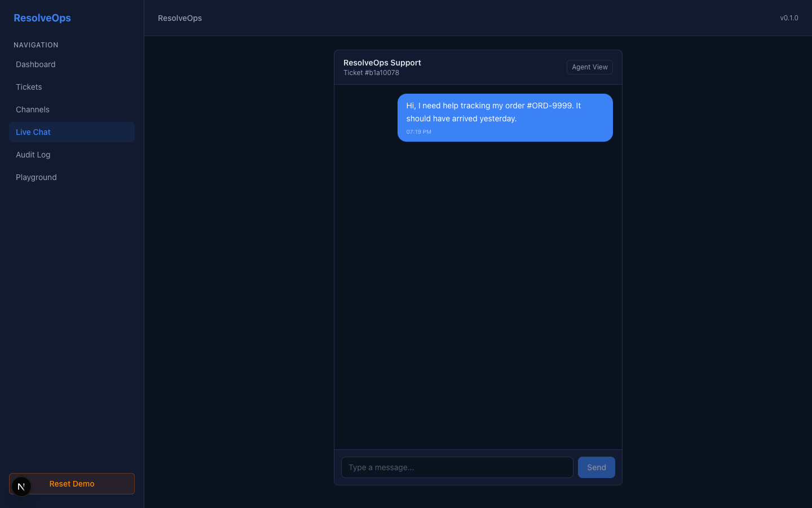

Once they start chatting:
- Messages appear as chat bubbles with timestamps
- The "Agent View" button links to the ticket in the ops dashboard
- Agent/AI responses appear via 3-second polling
- **Shadow mode drafts are invisible** to the customer until approved

The customer gets a fast, modern chat experience. The agent gets a fully-contextualized ticket with AI assistance.

---

### 8. Complete Audit Trail — Every Decision Logged

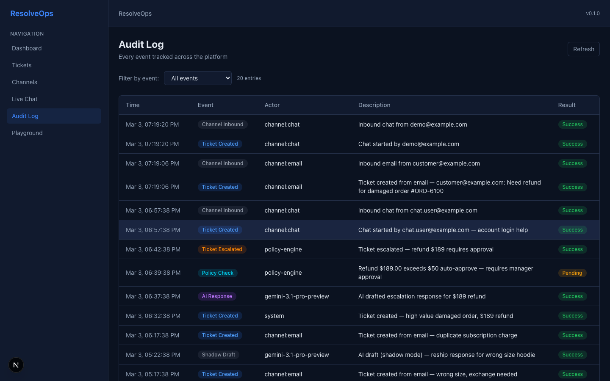

Every event in the system is logged with:
- **Timestamp** — when it happened
- **Event type** — color-coded (ticket created, AI response, policy check, action executed, shadow draft, channel inbound)
- **Actor** — who/what did it (system, gemini-3.1, policy-engine, channel:email, agent:manual-review)
- **Description** — human-readable explanation
- **Result** — success, approved, pending, rejected

This isn't just for compliance. It's how you answer:
- "Why did the AI refund this customer $34.99?" — *Because policy:refund-auto-approve-under-$50 allowed it.*
- "Did anyone review this response before it went out?" — *Yes, agent:manual-review approved the shadow draft at 2:15 PM.*
- "How many actions were auto-approved today?" — *Filter by action_executed + policy: actor.*

---

### 9. LLM Playground — Test and Tune

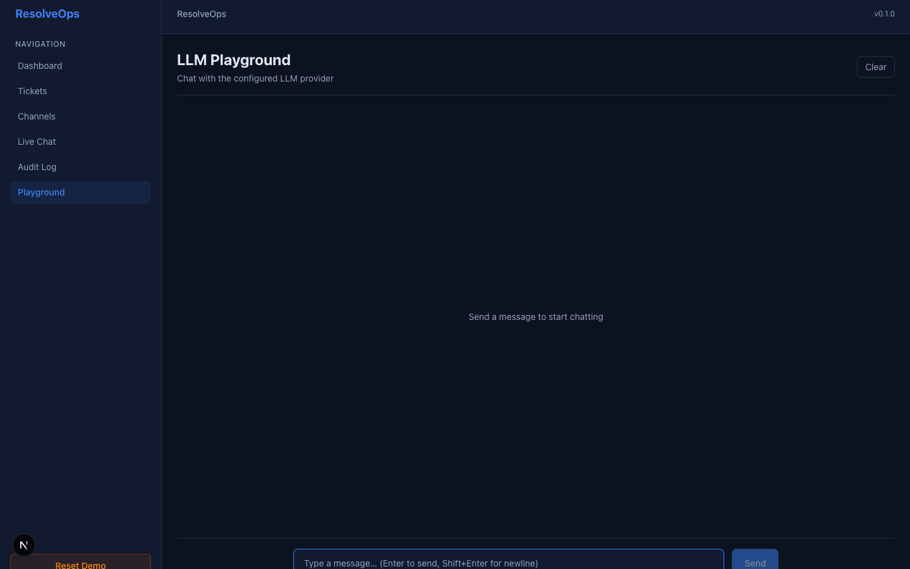

Direct chat interface to the underlying LLM (Gemini 3.1 by default, swappable to OpenAI/Anthropic). Test prompts, tune response quality, experiment with system prompts — all without touching code.

---

## What Makes This Different

| Traditional Support | ResolveOps |
|---|---|
| You buy software, hire people, configure AI | We take over the whole operation |
| AI suggests responses, humans copy-paste | AI executes actions behind policy guardrails |
| No audit trail for AI decisions | Every decision logged with actor + reason |
| Trust the AI or don't — binary choice | Shadow mode: gradual trust building |
| 3 vendors (helpdesk + AI + labor) | One partner, one bill |
| Setup in weeks/months | Go live in 1 day |

---

## The Numbers

- **Auto-resolve rate target:** 60%+ within 2 weeks of onboarding
- **Median time-to-first-response:** under 5 minutes (AI) vs. 4-12 hours (human teams)
- **Cost per resolution:** 30%+ below traditional staffing
- **Setup time:** 1 day (connect channels + upload policies + go live)

---

## What's Live Now (Phase 0 Complete)

- Dashboard with real-time metrics + channel breakdown
- Ticket CRUD with AI-powered resolution
- Shadow mode (AI drafts, human approves/edits/rejects)
- Policy engine with configurable thresholds and auto-approval
- Mock Stripe refund + Shopify reship executors with external ID logging
- Email inbound with automatic thread detection
- Live chat with customer-facing widget
- Complete audit trail with 14 event types
- LLM Playground (Gemini 3.1, swappable to OpenAI/Anthropic)
- Dark mode UI (light mode supported)

## What's Next (Phase 1)

- Authentication + multi-tenant
- Real Stripe + Shopify API integration
- Onboarding wizard
- Identity stitching (same customer across channels)
- Confidence-based escalation with AI-generated summaries
- Weekly insights reports

---

## The Ask

We're building the future of customer support. Not better software — no software at all. Just results.

**Connect your channels. Set your policies. Go live.**

ResolveOps handles everything else.
